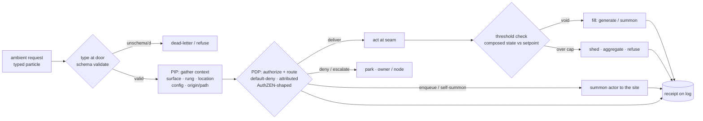

# ambient-gateway.chapter.md — the buildable 1-week target

**Status:** PROPOSED — a *chapter*, not an 11th arc (session-gateway §5b). It
**synthesizes two existing design proposals into one buildable target**;
nothing here is minted. bdo names the anthology this homes into and blesses
the build (D-4).

**Provenance:** drawn this session (Claude, on bdo's direction, 2026-06-18),
synthesizing [`gateway-policy-spine.proposal.md`](gateway-policy-spine.proposal.md)
(the PEP/PDP/PIP spine + fail-mode tier) and
[`session-gateway.proposal.md`](session-gateway.proposal.md) §13 (the
particle-mesh physics + gate→gateway→patrol→actuator economy). It invents no
new architecture — it wires organs that exist into a working ambient loop and
names the week.

**The gesture it serves (bdo, verbatim):** *"the skill and tools required to
setup several ambient requests to the gateway for it to process and potentially
trigger a threshold event which configured the environment based on the AuthZen
and summon actors to the site based on Policy-Decision-Points and
Policy-Enforcement-Points and the inference over the composed state based on the
configuration of the code and the origin of the request."*

## How this chapter was shaped (the ask, 2026-06-18)

A comprehension checklist + two forks set the scope. bdo's answers:

- **Confirmed:** dogfood on ontum itself (instance #1, §13.7); spine =
  `loop/gateway.py` growing `inference.authorize`; the threshold actuator does
  **both** — dial a setpoint **and** summon actors; this session **draws the
  target**, no code.
- **Unchecked — read as corrections (flagged here, correctable):**
  1. *"Native PDP first, AuthZEN later" is off* → **AuthZEN isn't a thing we
     adopt at all — it's the PEP/PDP/PIP _shape_ that informs a native build**
     (bdo's correction, below). Not a wire, not an engine: a decomposition we're
     *inspired by*. *Whether to ever put an external engine (OPA/Cedar) behind
     the native interface stays yours — study-first, D-4; the default is native.*
  2. *"Organ + pen, no served visual" is off* → **a served visual is in scope.**
     bdo's judging surface is the live URL (Causality is the precedent). The
     week includes a read-only served projection of the gateway operating.

## What we take from AuthZEN: the shape, not the wire (bdo's correction)

bdo, 2026-06-18: *"AuthZ-N … it's PEP + PDP + PIP. We can be inspired by AuthZEN,
inform our own shape."* AuthZEN's value to ontum is the **three-role
decomposition** — **P**olicy **E**nforcement / **D**ecision / **I**nformation
**P**oints — **as inspiration for a native build**, not a wire format to adopt.

| role | the question it answers | ontum's native organ |
|---|---|---|
| **PEP** — enforce | intercept the act, apply the verdict, obey | the guards + the git pen (the write seam) |
| **PDP** — decide | given act + context → an outcome | `loop/gateway.py` (grows `inference.authorize`) |
| **PIP** — inform | supply who/where/what-config | `trust.py` rungs + surface + location + config + origin-path |

A spec fit check this session (openid.github.io/authzen) **confirms there is
nothing to adopt literally**: AuthZEN's decision is a **boolean** permit/deny, so
it cannot carry ontum's **closed-set route** (4 of 6 outcomes are re-routes, not
allow/deny); and it has **no append-only/attribution** in the schema (only
optional out-of-band signing). So the wire would *fight* our shape. What we take
is the **decomposition**; we build it native. bdo's own derivation chain already
*is* PEP/PDP/PIP — AuthZEN just names it and shows the field converging on it.
(An AuthZEN-compatible projection is possible *only at a foreign-system egress*,
§13.5 — never the internal interface.)

### The shape is flavor-agnostic — Auth\*, not just AuthZ (bdo, 2026-06-18)

PEP/PDP/PIP is the **decision-point** shape, not the *authorization* shape.
AuthZEN is its AuthZ instantiation; OIDC is its AuthN instantiation. The shape is
the **genus**; the auth-flavors are **species** — and ontum already runs several
through one gateway (the classic **AAA**: Authenticate / Authorize / Account):

| flavor | the question | ontum's native organ |
|---|---|---|
| **AuthN** — authenticate | *who/what are you?* | identity from path + privilege (§13.5); the self-summon *proposed-identity* floor (§13.3); `node_real` admissions |
| **AuthZ** — authorize | *may you do this?* | `inference.authorize`, trust rungs, the policy set |
| **Accounting** — account/attribute | *what spent/earned, on whose line?* | the append-only receipt + `--by`; the §13.10 economy (`impact`/`energy`) — **the "A" the wire doesn't have** |

**A flavor is a _typed gateway_** — the same PEP/PDP/PIP shape with a different
`{question, decider, context-needed, outcome-set}`. That is §6's typed-fold
("the same operation, differing only in inputs and typing rule") at the gateway.
So `loop/gateway.py` is built **flavor-parametrized**, not AuthZ-only; the
flavors **compose at one gateway** (authenticate → authorize → account), with
ingress/egress carrying different policy (§13.5). That composition *is* bdo's
original **"inference over the composed state"**: AuthN settles *who*, AuthZ
settles *may*, Accounting settles *cost/attribution*, and the gateway routes on
the composed outcome.

## The one-line target

**Grow `loop/inference.authorize` from one seam (a thought) to the general seam
(any typed message)** — so ambient requests arrive, get typed + authorized +
routed (PEP/PDP/PIP), a crossed threshold reconfigures the environment and
summons actors, and a served surface shows it — every act attributed on the log.

## The flow



The closed outcome set is non-negotiable (§13.9): a router whose outcomes are
open is unauditable. Outcomes = `{deliver, enqueue-summon, self-summon,
escalate, deny, dead-letter}`.

## The five pieces — real vs proposed (no double-build, §9)

| Role | What carries it | State |
|---|---|---|
| **PDP/PEP core** | `loop/gateway.py` — generalize `inference.authorize(caller,surface,mind)` to `route(message, context)`; default-deny, closed outcome set, attributed receipt; **organized as PEP/PDP/PIP** (the shape AuthZEN names), built native | **proposed** (template `authorize` is real) |
| **PIP (context)** | compose `trust.py` rungs + surface (Claude/Codex) + worktree/location + `.pen.json`/fence config + the message's **origin-path** (§13.5 graded-trust-by-distance) | **real organs, needs composing** |
| **typed-message registry** | governed vocab in the `tags.py` shape (closed core + admitted extensions); each type binds `{schema, route, ingress/egress policy}`; unschema'd refused at the door (§13.4) | **proposed** |
| **the patrol** (the skill's engine) | scheduled surfacer over a bounded seam — finds work, types it, **presents to gateway, never judges** (I-3); detain = reversible quarantine only | **proposed** |
| **threshold actuator** | wired through the `disposer.py` fence — bounded **both-ways**: over-cap → shed/aggregate/refuse; void → fill (summon). Inference may **narrow within bounds, never widen** (policy-spine fail-tier) | **proposed** (fence is real) |
| **served visual** | a Causality-grain read-only projection on the live URL — requests flowing the door→route→threshold→summon | **proposed** (Causality served-surface is real) |

## The threshold actuator — both halves of the ask, as one organ

This is the load-bearing phrase ("configured the environment … and summon
actors") and bdo confirmed the both-ways shape:

```
composed state (a fold) vs an admitted setpoint
  ├─ over cap (e.g. human_queue_cap exceeded) → shed / aggregate / refuse  (I-7 cooling, generalized)
  └─ void (a sub-setpoint absence — a vacuum)  → FILL: summon a worker to the seam, PDP-gated
both moves are ONE admitted, attributed setpoint act (the disposer self-admit shape:
  the loop executes bdo's standing fence, it never signs its own line)
```

The **summon IS the environment-config** when the config is "staff it." This
wires the §13.10 actuator: "a sub-setpoint absence is a generation trigger, not
just an idle state." The teeth (§10): a void-fill that manufactures fake work to
hit a vanity number is **mercury** — refused, the same way `impact.py` already
refuses fake value.

## The skill + the tools (literally what bdo asked for)

- **Skill `gateway-ambient`** — the ritual that *sets up several ambient
  requests*. It composes request streams from configuration (workflow-as-code,
  §13.10: "composed from configuration, compiled by composition, routed through
  a gateway"), schedules the patrol over a chosen seam, and routes each request
  through the gateway. This is the `@`-import scope-stack generalized to request
  streams.
- **Tools:** `loop/gateway.py` (the router), the typed-message registry, the
  patrol fold, the threshold actuator, the served projection.

## The invariants the gateway inherits (not re-derived)

- **default-deny** — no thought/act without a permitting policy (inference.authorize).
- **no-self-sign / D-2** — a node never judges its own writer's output;
  attribution is the precondition for the whole economy (§13.10 point B).
- **monotonic privilege (§13.5)** — policy is cumulative, never looser than
  already held, unless an authoritative system grants escalation (the mesh's `sudo`).
- **self-summon floor (§13.3)** — an under-specified message may self-summon, but
  **begins at minimum capability (discovery-only, never mutate)** and produces a
  *proposed* identity a gate must admit; never self-grants.
- **two-tier failure (policy-spine)** — bright-line rules fail **closed** (e.g.
  `freeze_guard`, no inference, no exception); contextual policy fails **open** so
  a broken sensor never blocks the worker. Inference never derives a bright line.

## The 1-week increments (smallest-first; each ships standalone)

1. **The typed-message registry + the door** (~day 1) — governed vocab
   (`tags.py` shape); `gateway.type_message(msg)` validates against the
   registered schema, refuses unschema'd → dead-letter. Pure, testable, refuses
   on the first try (§10).
2. **The PDP/PEP core** (~day 1–2) — `loop/gateway.py route(msg, context)`
   generalizing `inference.authorize`: default-deny, closed outcome set,
   attributed receipt; `gather_context` composes the **PIP** natively; the
   **route output stays native** (closed set); the whole thing
   **PEP/PDP/PIP-shaped** (inspired, not adopted) and **flavor-parametrized**
   (v0 wires AuthZ + Accounting/attribution; AuthN via path/privilege); two-tier
   fail wired.
3. **The threshold actuator** (~day 2–3) — composed-state-vs-setpoint via the
   disposer-fence; both-ways (shed / fill-summon); bounded; attributed admission.
4. **The patrol + the skill `gateway-ambient`** (~day 3–4) — scheduled surfacer
   over one real seam (lean: the owner-stamp queue or the `gaps` backlog); types
   found work as messages, presents to the gateway, never judges; the skill sets
   up the ambient streams + schedule.
5. **The served visual** (~day 4–5) — Causality-grain read-only projection on the
   live URL: the door → route decision → threshold fire → summoned actor.
6. **Dogfood + harden** (~day 5) — run end-to-end on the one seam; prove a §10
   refusal (two locally-fine messages that *refuse to fit*); numbered report.

## §10 — teeth, non-examples, open holes

**Teeth:** the gateway must be able to **refuse** — a router that can never deny
is a gauge, not a gate. Test: a message at a seam its origin-path's accreted
policy doesn't permit is denied, with the policy id cited (the
`inference.authorize` default-deny, proven).

**Non-examples (what makes this rot):**
- a `route` outcome outside the closed set (inference inventing actions) — unauditable;
- a patrol that **judges** (collapses I-3 sense/act);
- a threshold whose setpoint is a code constant instead of an admitted, re-dialable record;
- a void-fill that manufactures fake work to hit a number (mercury);
- a self-summon that self-grants acting capability (bypasses the monotonic floor);
- a message type whose schema isn't validated at the door (a contract that can't refuse);
- routing a **bright-line** rule (e.g. `freeze_guard`) through inference-derived
  policy — how an absolute stops being absolute (policy-spine, non-negotiable);
- re-building `fence` / `inference` / `trust` / `gaps` instead of composing them.

**Open holes (bdo's calls):**
- **OH1 — ever adopt an external engine? (still yours, study-first).** The shape
  is settled: PEP/PDP/PIP, built native, *inspired* by AuthZEN (not a wire we
  adopt). What stays yours: whether to ever put an actual decision *engine*
  (OPA/Cedar/OpenFGA) behind the native interface. Built so it's a swap, not a
  rewrite — but the default is native.
- **OH2 — the patrol's seam.** Which real seam dogfoods first — owner-stamp
  queue, `gaps` backlog, or another? (Lean: `gaps`, it already pressure-orders.)
- **OH3 — the served visual's depth.** Live-tailing the log vs. a periodic
  render. (Lean: periodic render first, the Causality grain.)
- **OH4 — the anthology name** — *resolved:* **The Polity** (bdo, 2026-06-18).

## What this chapter does NOT do (out of the week, honest scope)

- the full **contribution economy** (§13.10 exemplars/notorieties, the wealth→
  privilege fold) — a later chapter;
- the **multi-channel observation fiber** (§13.6 — its seed is real in
  `orchestrate.py`, the n-channel fiber is not; the week builds at most a
  single-channel slice, marked);
- the **typed-fold algebra** (§6 — generalizing `reconcile.Fold`) — the big one,
  layered later;
- deciding **adopt-vs-native** (OH1) — bdo's, study-first.

## Homing — **The Polity** (bdo named it, 2026-06-18)

A **chapter of _The Polity_** — the anthology (session-gateway §5b/§12b) that
re-derives the overlapping arcs it composes (`inference-gateway`,
`owner-harness`, `virtual-fleet`, `the-field`, `substrate`) into one
self-governing body whose throughline is *the loop governs, provisions, and
staffs itself safely*. The name and the spine are one: the **Auth\*** triad is
the machinery of a polity — **admission** (AuthN) = citizenship, **authorization**
(AuthZ) = law, **accounting** = its economy (§13.10), **bdo** = the sovereign,
last stop (D-4); the **gateway** is its border-and-court, the **patrol** its
magistrate, **nodes** its officers summoned then dissolved (D-10). This ambient
gateway is the chapter where the Polity first decides, staffs, and accounts for
its own work at one seam. When blessed, increment #1 (the registry + door) is
the obvious first cut.
