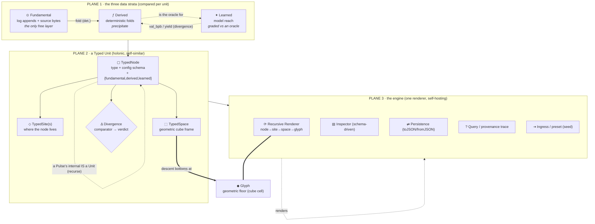

# Causality display system — the component & type board

> A circuit-board-detail map of the agnostic graph engine: every **component**
> the system needs, the **type** each requires, and how they wire together —
> so the Pattern Commons library and the generative typing process have an exact
> spec to hit. Authored from bdo's diagram + forks, 2026-06-15. **Draft / shaping**
> — open holes are named, not filled (grip discipline).

## What this system is (one line)

An **agnostic, holonic, self-hosting graph engine** that renders any typed graph,
descends through it to a **glyph-level geometric floor**, and at every unit shows
the **three-way comparison of fundamental vs derived vs learned data** — the
divergence *is* the meaning the witness reports. ontum's term-economy and
holonsearch's fabric mesh are two **presets** of the same engine.

## The front door — Interface as AI (the authoring paradigm)

> bdo's coinage, 2026-06-15. **Status: PROPOSED** (his term to mint; this is the
> drafted pin, awaiting his bless). It names and unifies threads already latent in
> the repo: the API-first rule in `epic.causality-surface`, Pattern Commons, and
> the experience skill. Belongs in Pattern Commons as the canonical deposit.

**Interface as AI — the AI is both the *maker* and the *medium* of the interface.**

- **AI as maker (generative).** The UI/UX is *generated* by AI from the governed
  **Pattern Commons**, fitted to the data and the user's intent — not hand-built
  per feature. The Commons is the vocabulary; the AI composes the surface.
- **AI as medium (interfacing).** The product is **fully API-first** (every element
  addressable by an AI) and the human's primary channel is **natural language**,
  mediated by the AI — not bespoke buttons / click-ops.
- **The governable substrate (the load-bearing third).** It only holds because of
  the **Commons** (generation stays consistent, not random), **API-first elements**
  (an AI can drive anything), and **schema + pens** (NL produces *validated drafts*;
  durable change still lands only through governed seams — D-4).

**The teeth (testable, refuses non-examples, §10):** a chatbot sidebar on a
click-ops app is **not** Interface-as-AI (bolt-on; elements not all API-addressable;
UI not AI-generated); an NL search box is **not** (a feature, not the paradigm);
one-time AI codegen of a static UI is **not** (maker once, not the live medium). It
qualifies only when the AI **generates the surface from the Commons** *and* the
human interfaces in **NL over a fully API-first product**.

This is why authoring on this surface is conversational, and the click-canvas /
recursion / gallery are **witness lenses** behind it — not the way you build.

## Baseline — already on the board (an *expectation*, not a component to design)

Present in `experience-foundry/lib/causality.js` today; carved out so we don't
re-model givens (bdo, 2026-06-15):

- typed **nodes** (10 types) with per-type behavior; typed **ports/routes**
  (incompatible wire refused — the seam contract)
- **pulses** carrying data; node **activation** (compute / infer)
- **energy** budget, **latency/temporal-expectation** (actual vs expected ms)
- **receipts**, setpoint **cards**, **readouts** (sparklines), feedback
  loops / runaway, **real local inference**

Everything below is the structural system *on top of* that baseline.

---

## The board — three planes

- **Typed connections** (sync, intra-cluster) and **iterated connections**
  (async, cross-cluster) are the two edge registers — drawn differently.
- The dotted self-loops are the **self-similarity / self-hosting** invariant: a
  pulse's internal is itself a Unit; the engine can render the engine.

---

## Component catalog (each = a Pattern Commons candidate)

Each entry: **what it is · its type · required fields/ports · where its data lives
today · its open hole.** "Type" is the schema a generative typing process must emit.

### Plane 1 — the data strata

**C1 · FundamentalDatum** — the raw given, the only *free* layer (the append).
- **Type:** `fundamental`
- **Requires:** `address` (file:line | log-record id), `hash` (sha256 of bytes),
  `append_only:true`. No derivation.
- **Lives:** `.ai-native/log/*.jsonl`, committed source bytes.
- **Hole:** corpus-from-outside (non-repo fundamental) is unmodeled.

**C2 · DerivedDatum** — deterministic precipitate folded from fundamental.
- **Type:** `derived`
- **Requires:** `fold` (the function symbol), `inputs[]` (fundamental refs),
  `determinism` (`inferred` | `proven`).
- **Lives:** `loop/*.py`, `causality/term_economy.py`, `glyphs/knoll.py` outputs.
- **Hole:** determinism is mostly *inferred*, not *proven* (holonsearch `--probe`
  rung is the fix).

**C3 · LearnedDatum** — the model's reach, only meaningful against an oracle.
- **Type:** `learned`
- **Requires:** `model`, `prompt`/`input`, `oracle_ref` (the derived/fundamental it
  is graded against), `divergence` (val_bpb | yield | surface-tension).
- **Lives:** inference plane (qwen3/mistral via gateway), holonsearch node-models,
  MODEL-GUESSED placements (`language/s-frame-placements.json`).
- **Hole:** no learned datum is yet *displayed beside* its derived oracle.

**C4 · DivergenceComparator** — the three-way compare; its output is the verdict.
- **Type:** `divergence`
- **Requires:** `strata{fundamental?,derived?,learned?}`, `metric`, `verdict`
  (taxonomy: `minted-*` | `projected` | `proposed` | `poetic` | `overloaded` |
  `orphaned` | `ghost` | + holonsearch's `yield`).
- **Lives:** `term_economy.classify` (fundamental↔derived today); holonsearch
  `score.grade` (learned↔derived). **This component unifies the two.**
- **Hole:** the unified three-way comparator does not exist yet — it is the heart.

### Plane 2 — the typed unit (holonic)

**C5 · TypedNode** — a unit (atom / pen / term / loop-node).
- **Type:** `node:<kind>` (kind from the per-type SCHEMA)
- **Requires:** `id`, `type`, `label`, `config` (per-type, schema-driven),
  `sites[]`, `space`, `strata{C1,C2,C3}`, `divergence` (C4).
- **Lives:** `causality.js` node model (config already rich); `TermNode` in
  `contracts/projection-api.md`.
- **Hole:** the node carries no `sites`/`space`/`strata` today — additive.

**C6 · TypedSite** — a *place a node lives* (a node has several).
- **Type:** `site:<kind>` (file | log-surface | doctrine-§ | glyph-cell)
- **Requires:** `id`, `address`, `stratum` (which of C1–C3 it grounds), `resolved`.
- **Lives:** `SiteNode` (spec-only) in `contracts/projection-api.md`.
- **Hole:** **fork** — is a Site always tied to one stratum, or stratum-independent?

**C7 · TypedSpace** — the geometric embedding frame a unit sits in.
- **Type:** `space:cube` (the lawful cube over a learned dim)
- **Requires:** `dim`, `basis`, `coordinate`, `parent_frame` (for descent),
  `incidence_laws` (closure = 3^dim, star = 2^codim, Σ = 125).
- **Lives:** `glyphs/registry.json` + `glyphs/viewer.html` (CUBE_MATH/FRAME_MATH);
  holonsearch "embedded in a fixed lawful cube over a learned dim."
- **Hole:** is +X/+Y/+Z literal placement (the cube) or a queryable property
  space? (Reading: **literal cube**, per the dual +X axis.)

**C8 · TypedPulse** — a message that flows; **its internal IS a Unit (recurse)**.
- **Type:** `pulse:<kind>`
- **Requires:** `id`, `data`, `internal_graph` (self-similar — a sub-Unit),
  `route`, `stratum`.
- **Lives:** pulses exist in `causality.js` as data-carrying dots; the
  *internal-graph* (self-similarity) is new.
- **Hole:** descent into a pulse's internal — same renderer, one level down.

**C9 · Glyph** — the atomic geometric floor; descent stops here.
- **Type:** `glyph`
- **Requires:** `cube_coordinate`, `system` (S-frame | letter), `provenance`
  (PINNED | DERIVED | MINTED | OPEN).
- **Lives:** `glyphs/` (generated from `docs/phase-2/` by `knoll.py`).
- **Hole:** the glyph floor is read-only/generated — Causality renders it, never
  mints it.

### Plane 2 — the edges (two registers)

**C10 · TypedConnection** — sync wire inside a cluster.
- **Type:** `edge:<kind>` (impulse | delayed | proportional | leak)
- **Requires:** `from`, `to`, `kind`, `sign`, `port_compat` (out ⊇ in), `stratum`.
- **Lives:** `S.link` + `PORTS`/`assignable` in `causality.js`; `EvidenceEdge` in
  the contracts; ontum incidence (`touches`/`must_not_collide_with`/`hands_off_to`).
- **Hole:** edges carry no stratum tag today.

**C11 · TypedIteration** — async, cross-cluster connection ("iterated space").
- **Type:** `iteration:async`
- **Requires:** `from_cluster`, `to_cluster`, `async_mode`, `level_trigger`
  (re-derive on change, not push).
- **Lives:** async seams — inbound-envoy, async-signal-surfacing, the loop's
  level-triggered fold.
- **Hole:** clusters aren't a first-class object yet (see C12).

### Plane 3 — the engine

**C12 · RecursiveRenderer** — one renderer; the core gesture is descent + compare.
- **Type:** engine component
- **Requires:** *a graph at every level* (Unit→sites→space→glyph), breadcrumb
  ascent, self-similar geometry, the C4 comparison drawn on each node.
- **Lives:** `S.render` (flat today); glyph viewer's frame-descent is the proof
  the gesture works.
- **Hole:** generalize flat render into leveled render (the build).

**C13 · Inspector (schema-driven)** — click node → config for its type; click edge
→ its config; edits persist.
- **Requires:** the per-type **SCHEMA** (drives defaults + panel + persistence).
- **Lives:** *missing* (`configPanels: []`, audit Finding 1).

**C14 · Persistence** — `toJSON`/`fromJSON` over the schema → localStorage + file.
- **Requires:** serializable schema, named/versioned records.
- **Lives:** *missing* (every reload wipes, audit Finding 3).

**C15 · Query / provenance trace** — the graph is queryable; every projection
carries a **traceable route to source** (holographic).
- **Requires:** type-index, provenance edge back to the C1 fundamental.
- **Lives:** `term_economy audit/mermaid` (static); interactive trace is new.

**C16 · Ingress / preset (seed)** — a domain loads as data, not code.
- **Requires:** a seed conforming to the type schemas (C5–C11).
- **Lives:** `examples/ontum-terms.seed.json` (ontum preset); holonsearch mesh is
  the second preset that proves agnosticism.

**C17 · Self-host harness** — Causality renders Causality (the board as a graph).
- **Requires:** the engine's own components expressed as C5–C11 instances.
- **Lives:** *new* — the test of "self-hosting."

---

## The anima overlay — WEAK↔STRONG · FAST↔SLOW (cross-cutting, felt field)

The three strata are the **epistemic** axis (*what is grounded*). The anima is the
**felt** axis (*how it lives and moves*) — bdo's soul/felt-field, carried by every
Unit, Pulse, and Edge as a two-dimensional signature. Crucially this is mostly
**representation of values the system already folds**, not new computation — so it
rides the baseline "already capable" budget:

- **STRENGTH · WEAK ↔ STRONG** — force / weight / consequence. Folded from
  **energy** (`loop/energy.py` — energy-per-act, burned, strain) and **impact**
  (`loop/impact.py` — field weight: concentrate ↔ tailings ↔ black-sand). STRONG =
  high-energy / high-impact / load-bearing; WEAK = burned / tailings / dim.
- **TEMPO · FAST ↔ SLOW** — pulse-beat and breath. Folded from the orchestrator's
  **heat/cool** (`loop/orchestrate.py`) and **temporal** pressure (`loop/temporal.py`
  — dawn/dusk, run-hot/consolidate) and per-node **latency** (actual vs expected ms,
  already on the board). FAST = hot / quick beat; SLOW = cool / deep breath.

The 2×2 reads as the anima's moods — **fast·strong** = vigorous (hot frontier),
**slow·strong** = deep/grounded (load-bearing organ), **fast·weak** = jittery
(churn — the unsensed failure in [[ontum-cause-finality-conscious-revision]]),
**slow·weak** = dormant (the census prune candidate). The display *shows the mood*.

**C18 · AnimaSignature** — the felt overlay every unit/pulse/edge carries.
- **Type:** `anima` (a cross-cutting facet, not a standalone node)
- **Requires:** `strength` (weak↔strong, ∈[0,1]), `tempo` (fast↔slow, ∈[0,1]),
  each with its **source fold** (energy/impact for strength; heat-cool/temporal/
  latency for tempo) so the value is *traceable*, never decorative.
- **Lives:** `loop/energy.py`, `loop/impact.py`, `loop/orchestrate.py`,
  `loop/temporal.py` — the folds exist; the *representation* is what's new.
- **Renders as:** STRENGTH → node size / ink weight / saturation; TEMPO → pulse
  speed / animation rate / wobble frequency (the baseline already wobbles with
  energy — this makes it an explicit, labelled axis). Composes with the strata
  divergence (H4): epistemic = *colour/layer*, anima = *size & motion*.
- **Hole (H7):** does anima attach only to live units, or also to the *historical*
  trace (a node's anima over time, the pulse-beat as rhythm)? bdo's "rhythm/breath"
  hints temporal — confirm.

## Type requirements (the table that feeds generative typing)

Every type the system mints, with the fields a generator must produce:

| Type | Kind axis | Required fields | Grounded by |
|---|---|---|---|
| `fundamental` | — | address, hash, append_only | bytes resolve |
| `derived` | fold | fold, inputs[], determinism | fold resolves + (proven) |
| `learned` | model | model, input, oracle_ref, divergence | oracle resolves |
| `divergence` | metric | strata{}, metric, verdict | ≥1 stratum resolves |
| `node` | stock/source/sink/code/inference/gate/pointer/pen/card/readout/… | id, type, label, config, sites[], space, strata, divergence | schema entry |
| `site` | file/log/§/glyph-cell | id, address, stratum, resolved | address resolves |
| `space` | cube | dim, basis, coordinate, parent, laws | incidence laws hold |
| `pulse` | — | id, data, internal_graph, route, stratum | route legal |
| `glyph` | S/letter | cube_coordinate, system, provenance | knoll re-validates |
| `edge` | impulse/delayed/proportional/leak | from, to, kind, sign, port_compat, stratum | ports compatible |
| `iteration` | async | from_cluster, to_cluster, async_mode, level_trigger | seam registered |
| `anima` | facet | strength{val,source}, tempo{val,source} | energy/impact + heat-cool/temporal folds resolve |

**The closure rule (teeth, §10):** a type with no resolvable grounding can never
be `minted` — it stays `proposed` or surfaces as `ghost`. Same refusal
`term_economy.py` and `loop/gaps.py` already make.

## The generative typing process (how a new type is minted)

Lifted from holonsearch's forge + ontum's admission discipline — types are
**generated from evidence, graded, then admitted**, never hand-declared:

1. **Propose** — scan a source (a fold, a doctrine term, a seed) for a candidate
   type; emit it with its **etymon** (origin `file:symbol@line` + source hash).
   *(holonsearch `tools/forge.py` does exactly this for folds.)*
2. **Ground** — resolve the candidate's required fields against committed bytes;
   compute its stratum (fundamental/derived/learned) and its divergence verdict.
3. **Grade** — round-trip / fixture it (derived) or grade vs oracle (learned);
   record yield/val_bpb. No grounding → stays `proposed`.
4. **Admit** — a human/owner stamp (D-4) promotes `proposed` → minted; the type
   enters the **Pattern Commons** as a reusable pattern with its schema + etymon.
5. **Drift-watch** — re-resolve source hashes; a moved hash flags re-forge (the
   organism noticing its own memory go stale).

The Pattern Commons is therefore **the library of admitted types** — each carries
its schema (the type requirements above), its etymon (provenance), and its
divergence class. A new domain ships as a **preset of Commons types**, which is
what makes the engine agnostic.

## The work pattern (demo-driven — bdo, 2026-06-15)

A component is not "progress" until it can be *seen and clicked*. Each component on
the board moves through one loop:

1. **done-line** — the frozen bar (what "this component works" means).
2. **build** — schema-driven, in `causality/`.
3. **interactive demo** — a live card in `causality/demos.html` (the gallery /
   progress board), opened in a browser and judged by hand (the experience skill's
   accept/reject surface). No component ships without one.
4. **§10 headless test** — deterministic, with a negative control (the teeth).
5. **PR → the merge-node lands** (the arc is confirmed).
6. **bdo's reaction → Pattern Commons** — praise/refusal becomes a reusable deposit.

The gallery doubles as the **progress surface**: every component shows
`shipped / building / baseline / planned`, and shipped ones are live. Progress is
that board filling in — `python -m http.server 8080` →
`localhost:8080/causality/demos.html`. Reusable parts (the inspector → `inspector.js`)
are factored to one source so the tool and the demos never drift (the Commons rule).

## Named holes (grip discipline — open, not invented)

- **H1 — the unified three-way comparator (C4)** does not exist; it is the heart
  and the highest-leverage build.
- **H2 — Site↔stratum** (fork): is a Site bound to one stratum or independent?
- **H3 — Space rendering** (fork): literal cube placement vs queryable property
  space. (Working read: literal cube.)
- **H4 — divergence rendering** (fork): overlaid strata layers, per-node split
  indicator, or a divergence edge between a node's three versions?
- **H5 — clusters** (C11/C17) aren't first-class yet; "iterated/async" edges and
  self-hosting both depend on them.
- **H6 — determinism is inferred, not proven** for most derived data (C2).

## Smallest first cut (when we build)

The recursive schema + Inspector + Persistence (CZ2, already the live leverage
point) — but with the node model widened to carry `sites`, `space`,
`strata{fundamental,derived,learned}`, and the `anima{strength,tempo}` signature
from the start, so the three-strata comparator (C4/H1) and the felt overlay (C18)
both have somewhere to land. Anima is the cheap early win — its folds
(`energy`/`impact`/`temporal`) already exist, so it is representation over compute.
Glyph floor and self-hosting come after the comparator proves the gesture on one
real node.
