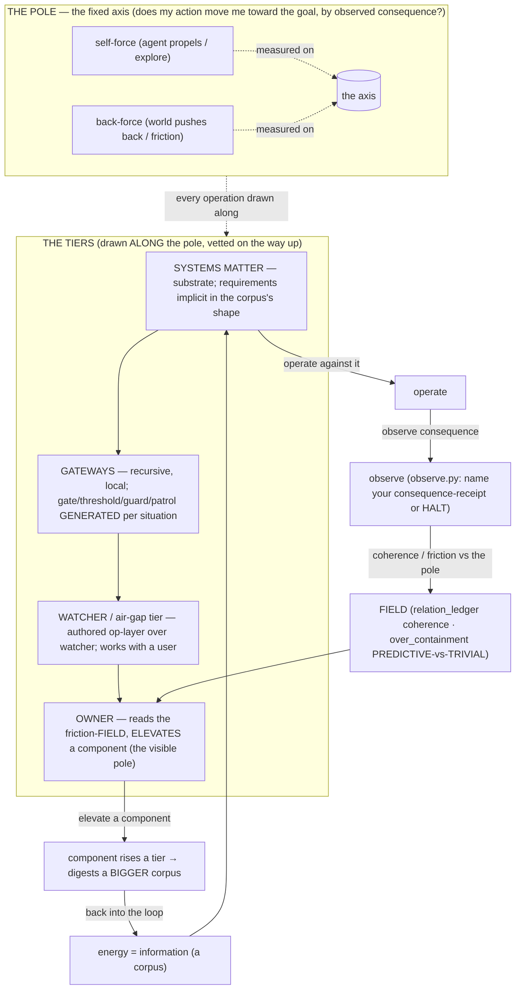

# Pencil roughs — model-free agent substrate (the spine)

*Explore-tier. Pencil = provisional, erasable, multiple attempts. Not committed,
not an atom, not a done-line. Vocabulary is the concept's own; no new coinages.*

---

## 1. The whole spine (orientation rough)

### 1a. Mermaid — the cycle ("button-masher") loop, tiered



### 1b. ASCII — the pole as the literal spine, the loop wrapped around it

```
            energy (information / a corpus)
                       |
                       v
   +======== THE POLE (one fixed axis) ========+      the loop:
   |                                            |
   |   goal  ^                                  |     [1] systems matter  -- substrate
   |         |        * watcher-tier            |     [2] operate against it
   |  self-  |      * gateway (gen'd)           |     [3] observe consequence  (observe.py)
   |  force  |    * gateway (gen'd)             |     [4] coherence / friction vs pole
   |  (push) |   o component (low coherence)    |     [5] surfaces as a FIELD
   |         |  * systems-matter mark           |     [6] OWNER reads + ELEVATES one
   |         +----------------------------->    |     [7] -> digests a bigger corpus
   |              back-force (friction)         |          -> back to [1]
   |                                            |
   +============================================+
   floor in code:  observe.py (HALT w/o receipt) |
                   relation_ledger.py (coherence) |  <- everything BELOW the owner is SHARP
                   over_containment.py (PRED/TRIV)|     the TOP patch is the smudge -> sec.2
```

The axis does not generate; it is the dimension everything generated is *measured*
on. Self-force and back-force are operations drawn along it, not new tiers.

---

## 2. The smudged region — owner's friction-field + one-gesture elevation

*Four thumbnails, four compositions. The open question each one attacks: how does
the owner SEE the friction as a field, and ELEVATE a component against it in a
single gesture? These are thumbnails — composition tests, not specs.*

### Thumbnail A — "the visible pole" (literal vertical axis, beads on a wire)

```
   goal
    ^         the field IS the pole, stood upright; components are beads on it.
    |  [GW]<------+         height = coherence (how far the component moved us).
    |   |         |  back-force (friction) shown as the leftward drag arrow.
    |  (o)  watcher tier . . . . . . . air-gap . . . . . . . . . . . . .
    |   |
    |  [GW]<--+   gesture: GRAB a bead, FLICK it up past the next notch = ELEVATE.
    |   |     |   one motion, one component, one tier. nothing else moves.
    |  (*)  gateway tier
    |   |
    |  (.)(.)(.)  systems-matter marks (the substrate floor)
    +----------------------------------------------------> back-force
```
- **Right:** the pole is literally visible and singular; elevation is one physical
  flick along the axis the physics already lives on — gesture and metaphor agree.
- **Rough:** a 1-D wire hides *why* a bead sits where it does; back-force is only an
  arrow, not a field. Crowded substrate floor gets unreadable fast.

### Thumbnail B — "friction terrain" (2-D contour field, tap the hot ridge)

```
   self-force ->
   .  .  .  .  .  .  .  .  .  .  .  .  .  .  .  .
   .  ___           ((HOT))            .  .  .      contours = friction.
   . /   \   .   .  / ## \  <- high back-force      x = a component, plotted by
   .(  x  ) .  .  (  ###  )   here: PREDICTIVE       (self-force, back-force).
   . \___/   .  .  \ ## /     stabilization          a RIDGE = where the world
   .  .  .  cool .  .--.   .   .  .  .  .  .          pushes back hardest.
   .  .  o(TRIVIAL/untested, valley) .  .  .
   .  .  .  .  .  .  .  .  .  .  .  .  .  .  .
                                          gesture: TAP the component on the
   legend: x predictive   o trivial        hottest PREDICTIVE ridge -> elevate.
```
- **Right:** shows friction as an actual *field* with shape; over_containment's
  PREDICTIVE-vs-TRIVIAL becomes the read that tells a real ridge from a dead valley
  (don't elevate the untested-stable). Owner sees terrain, picks the peak.
- **Rough:** "tap the hottest ridge" is ambiguous as a single gesture — needs a
  rule for *which* peak (highest coherence? steepest climb?). 2-D plot of an
  open-set of components could clutter; no built-in sense of tier.

### Thumbnail C — "tier-bands, one lift" (horizontal strata, glow per band)

```
  +=============================================================+  <- owner reads
  | OWNER          the friction-field, banded by tier            |     down the stack
  +=============================================================+
  | WATCHER / air-gap   [####. friction] (o)comp  (o)comp        |
  +-------------------------------------------------------------+
  | GATEWAYS (gen'd)    [#######. friction] (o) (o)(*)<-ready     |   glow = friction
  +-------------------------------------------------------------+      load per band
  | SYSTEMS MATTER      [##. friction] (.)(.)(.)(.) substrate     |
  +=============================================================+
            gesture: PULL (*) up across ONE band boundary = elevate.
            (it now digests the bigger corpus the upper band sees.)
```
- **Right:** the tiers are explicit, so "elevate" reads exactly as the concept means
  it — a component crosses ONE band and digests a bigger corpus. Per-band friction
  glow is a fast at-a-glance "where's the heat." Maps cleanly to the four-tier stack.
- **Rough:** loses the *pole* — friction is a glow bar, not a measured axis; risks
  becoming a kanban-looking board (a queue, which bdo rejects). "Bigger corpus" is
  asserted, not shown.

### Thumbnail D — "force-balance gauges" (per-component net, stamp the leader)

```
   each component = one gauge:  self-force (->) vs back-force (<-), net needle.

     comp:gateway-A      comp:watcher-B       comp:sysmatter-C
     <----|---->         <--------|->         <-|-------->
       net +0.7 PRED       net -0.2 TRIV        net +0.1 untested
     [ ELEVATE? * ]       [   hold   ]         [  probe first ]

   the field = the gauge cluster, sorted by net coherence.
   gesture: one STAMP on the single most net-positive PREDICTIVE gauge -> elevate.
```
- **Right:** collapses the whole read to one comparable number per component +
  a predictive/trivial flag, so the single gesture is unambiguous (stamp the leader)
  — closest to ontum's existing confirm-arc/one-stamp shape. Hides nothing about
  *why* (the needle shows the force balance).
- **Rough:** reduces a *field* to a sorted list of dials — loses spatial/terrain
  intuition and the sense of the pole as one continuous axis; can feel like a
  leaderboard rather than a field.

---

## 3. Readiness note — the on-log sketch primitive as a drivable tool

*Per the proposal's "Implementation details" (steps 1–2) and wave-1 framing (the
closing line): wave 1 = the mark-label on `loop.gaps` + a cheap sketch primitive on
the log + an `un_inked()` fold with one summon line. Assessment only — NOT a build.*

What exists today to lean on:
- The **whiteout / supersede** already mints a pentimento (a visible superseding
  append, never an edit) — proposal names it the sketch primitive's *eraser*.
- `loop/pen.py` `carbon_divergences` + the records-pen write seam — the determinism
  the guard and pen share.
- `loop.gaps.effective_mocks()` already computes the un-admitted/mock set the
  `un_inked()` fold would consume.

What the minimal primitive would need before I could *drive* it as a real tool:
1. **A draft-mark append verb** — a sketch lands on the log *without a gate* (step 2),
   the one new write path the proposal admits. Needs: its own record kind (a
   `mark: sketch` stamp), a fleet-safe id, and carbon-copy determinism so the
   write_guard passes it (it must reuse `loop.pen.carbon_divergences`, not a twin).
2. **Pairing with the existing whiteout as eraser** — erasing a sketch must emit the
   supersede trace, not a deletion (the "keep the ghost" correcting principle). The
   primitive is only half a tool without the erase leg wired.
3. **The `un_inked()` read-only fold** — sketch marks with no atom behind them +
   `effective_mocks()` + proposals with no done-line, ranked; writes nothing. This is
   the off-log gate generalized from PRs to all three sketch media.
4. **One summon line** — `loop.summon`/`loop.gaps` labels each gap with its mark
   ("un-inked sketch" / "paint that never reached the wall") so a waking session
   inherits a stage-aware situation, not a janitorial gap (step 1, pure relabel).
5. **Tests with teeth (§10)** — the kill-test: a draft that *looks* inked must fold as
   un-inked; an erased sketch must still be countable as a ghost. If everything passes
   first try the fold isn't doing its job.

Readiness verdict: **the eraser half (whiteout) is real; the draft-mark append verb
and the `un_inked()` fold are the missing load-bearing pieces.** The primitive is not
yet drivable — but the proposal scopes it as a *label + one fold + one small write
path on existing pen machinery*, so the gap to a real tool is wave-1-sized, not a new
subsystem. Nothing here is built or committed.

---

## 4. Composition insight — which thumbnail I'd carry forward

I'd carry **C (tier-bands, one lift)** as the frame, borrowing **D's net/PREDICTIVE
read** as the per-component marker inside each band. C is the only thumbnail whose
single gesture *is* the concept's "elevate a component up a tier so it digests a
bigger corpus" — the others render friction beautifully but make elevation either
ambiguous (B's "hottest ridge") or tier-blind (A's wire, D's leaderboard). C's
weakness is that it drops the pole and risks looking like a queue; D fixes exactly
that by giving each component a measured self-force/back-force needle, so the band
keeps the pole's physics visible inside it. A stays useful as the literal "visible
pole" teaching picture; B is the right lens for a *drill-in* once a band is chosen.
```
