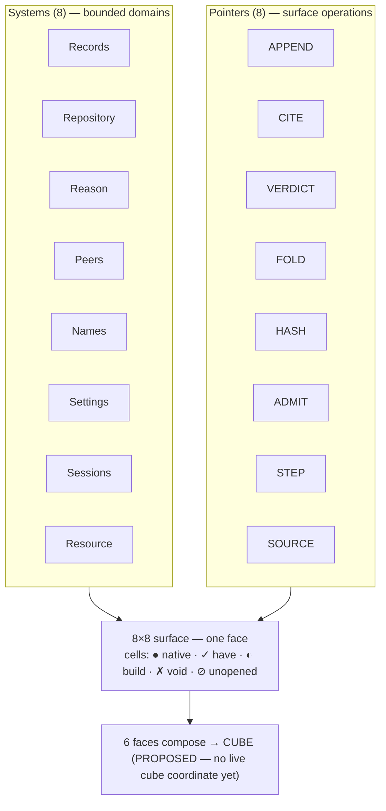

# The systems × pointers grammar

## Layer 1 — Systems (bounded domains)

A System maintains a domain. *A System is a record program / application.*

```
Records      Repository   Reason       Symmetry/Peers
Names        Settings     Sessions     Resource
```

## Layer 2 — Pointers (surface operations)

A Pointer is how a surface is touched.

```
APPEND   CITE   VERDICT   FOLD   HASH   ADMIT   STEP   SOURCE
```

## Layer 3 — Native surface declarations (the diagonal)

`System Surfaces of [SYSTEM]: [NATIVE_POINTER]` — each system's home face.

| System | native pointer | native address |
|---|---|---|
| Records    | APPEND  | `Records.APPEND` |
| Repository | CITE    | `Repository.CITE` |
| Reason     | VERDICT | `Reason.VERDICT` |
| Peers      | FOLD    | `Peers.FOLD` |
| Names      | HASH    | `Names.HASH` |
| Settings   | ADMIT   | `Settings.ADMIT` |
| Sessions   | STEP    | `Sessions.STEP` |
| Resource   | SOURCE  | `Resource.SOURCE` |

The diagonal does **not** mean "Records can *only* APPEND." It means
APPEND is the *native* face of Records. `HASH(Records)` is still a legal
address — see Layer 4.

## Layer 4 — Cross-surface composition

Canonical syntax:

```
POINTER(System)          # composed address — any pointer, any system
SYSTEM.NATIVE_POINTER     # native address — the diagonal
```

The platform is the **admitted cross-product** of systems × pointers:
8 × 8 = 64 candidate cells, of which 8 are native and the rest are
opened (or refused) one at a time. The grade of every cell lives in
[matrix.md](matrix.md).

## The shape



One 8×8 grid is **one surface (one face)**. Six faces compose a **cube**
(6 faces / 8 corners / 12 edges). That cube already has a home — the
`glyphs/` phase-2 lattice — but it is **PROPOSED**: no live record
carries a cube coordinate yet (corpus-derivation finding). Open question
held in matrix.md: is the composing unit the **6 faces** or the **8
corners**?

## Industry-standard parity (test the grammar against known patterns)

Read each as a *shape to measure against*, verdict the fit honestly.

| Our piece | Industry standard | Fit / gap |
|---|---|---|
| `events.jsonl` is truth; folds derive state | **Event Sourcing + CQRS** | **strong** — event store = the log; projections = folds; idempotency key = `(node, artifact_hash)`; replay = `reconcile` |
| Systems "maintain domains" | **DDD Bounded Contexts** | **strong** — a System *is* a bounded context |
| 8×8 Systems × Pointers | **CRUD / capability matrix** | fit — entities × operations |
| native diagonal vs composition | (mostly original) | closest = primary-port / default-method |
| 8×8×6 cube | **OLAP hypercube / tensor** | analogy — dimensions × measures × slices |
| `have / build / void` verdict | **gap analysis / capability maturity** | fit — the **ghost-refusal** is the tooth most maturity matrices lack |

Headline: the substrate is **textbook event sourcing**, and it mostly
passes. That is the standard to keep measuring against as the matrix
fills.
